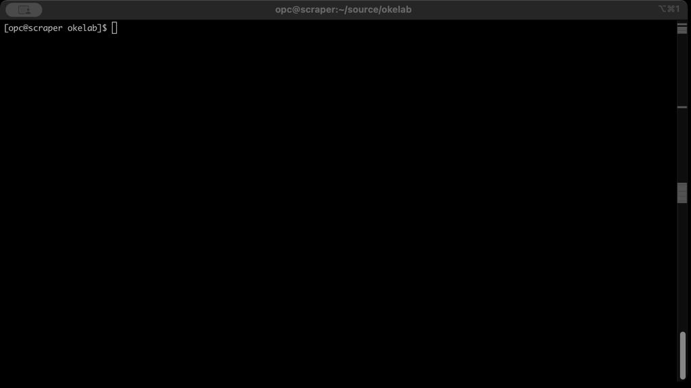
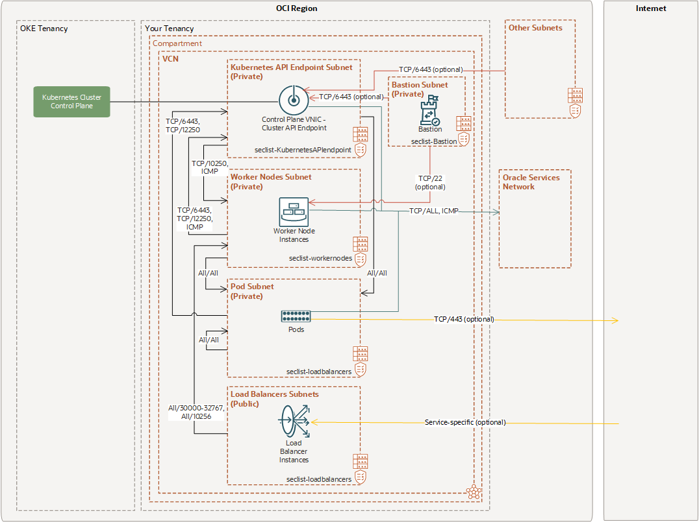

# EeasyOKE project

## Automated Kubernetes Cluster Deployment on Oracle Cloud Infrastructure up and running in minutes

This IaC code provides a simple way to automate the deployment a OKE cluster on Oracle Cloud Infrastructure including all requirements.

It is useful for starting without extensive expertise or as a foundation code ready to extend.

I used Pulumi as an IaC tool because, for various personal reasons, I prefer it over Terraform. However, don't worry; under the hood, Pulumi uses Terraform.

## Why EasyOKE?

The main requirements that motivated me to develop this code are as follows:

- **Simplicity**: Up and running in minutes without any prompt and OCI expertise.
- **Working**: Most online examples available are complex and non-functional.
- **Well-architected**: The template is designed to cover the best possible security practices, such as embracing all availability domains, restricted ACLs, native VCN networking etc.

🚀 Check out how easy it is to deploy and use a Kubernetes cluster! 🌟



## Architecture deployed with EasyOKE

The architecture defined is based on the well written [OCI article](https://docs.oracle.com/en-us/iaas/Content/ContEng/Concepts/contengnetworkconfigexample.htm#example-oci-cni-publick8sapi_privateworkers_publiclb)



OKE cluster is depolyed as [BASIC](https://docs.oracle.com/en-us/iaas/Content/ContEng/Tasks/contengcomparingenhancedwithbasicclusters_topic.htm) cluster type with no costs.

Costs depending on shape type and nodes selected, please estimate the correct costs with the [Cost estimator page](https://www.oracle.com/cloud/costestimator.html).

The default settings deploy a simple cluster leveraging the [Oracle Cloud Free Tier](https://www.oracle.com/cloud/free/) with no cost, always free (2 VM ARM Ampere A1 Compute).


## Why Pulumi?

I chose Pulumi because it is very easy to automate and develop logical implementations. The main features are:

- Automatic creation of the VCN with subnetting calculation; you only need to define the supernet CIDR.
- Automatic discovery of all availability domains to best configure the OKE pools spreaded across all domains to obtain maximum availability.
- Automatic discovery of the latest, correct and optimized OKE node image.
- Kubernetes config file automagically generated, ready to use, for example, with `export KUBECONFIG=$PWD/kubeconfig`.

## Prerequisites

1. Install Pulumi CLI - https://www.pulumi.com/docs/get-started/install/
2. Install Python - https://www.python.org/downloads/
3. Install OCI CLI - https://docs.oracle.com/en-us/iaas/Content/API/SDKDocs/cliinstall.htm
4. Oracle credentilas for Pulumi - https://www.pulumi.com/registry/packages/oci/installation-configuration/

### Environment set-up

Clone this repository and downloads all Python requirements.

```bash
git clone https://github.com/enricopesce/easyoke.git
cd easyoke
python -m venv .venv
source .venv/bin/activate
pip install poetry
pulumi install
```

## Configuring the stack

Optional: Use local state file (if you don't save your data on pulumi cloud)

```bash
mkdir oci-stack-statefile
pulumi login file://oci-stack-statefile
pulumi stack init testing
```

Initialize the pulumi stack

```bash
pulumi stack init testing
```

There are some configurations necessary to personalize the stack configuration.

Required config:

```bash
pulumi config set compartment_ocid "ocid1.compartment.oc1..aaaaaaaaqqu7dsadsadsadsdsdasdsdasdsad" # compartment ocid example
```

Optional configs:

```bash
pulumi config set vcn_cidr_block "10.0.0.0/16" # the supernet
pulumi config set node_shape "VM.Standard.E5.Flex" # the shape type
pulumi config set kubernetes_version "v1.29.1" # the supported OKE kubernetes version
pulumi config set oke_min_nodes "3" # minimal Kubernetes nodes
pulumi config set oke_ocpus "2" # OCPU numbers per node
pulumi config set oke_memory_in_gbs "32" # RAM memory per node
pulumi config set ssh_key "ssh-rsa AAAAB3NzaC1yc2EAAAADAQABAAABAQC7Q8zBoB...." # ssh key content
```

I suggest you to use all options to best fit you requirements, all default settings are saved on Pulumi.yaml file.

you can display all configurations set via the following command

```bash
pulumi config
KEY                 VALUE
compartment_ocid    ocid1.compartment.oc1..aaaaaaaaqqu7dsadsadsadsdsdasdsdasdsad
kubernetes_version  v1.29.1
node_image_id
node_shape          VM.Standard.A1.Flex
oke_memory_in_gbs   32
oke_min_nodes       3
oke_ocpus           2
ssh_key             ssh-rsa AAAAB3NzaC1yc2EAAAADAQABAAABAQC7...
vcn_cidr_block      10.0.0.0/16
pulumi:tags         {"pulumi:template":"python"}
```

## Deploy the stack

The deployment phase is very easy:

```bash
pulumi up
```

The creation needs 10/15 minutes

## Configure kubectl

When the deployment is done, you can use directly the kubeconfig file created in the same path or copy where you prefer

```bash
chmod 600 kubeconfig
export KUBECONFIG=$PWD/kubeconfig
kubectl get pods -A

NAMESPACE     NAME                                   READY   STATUS    RESTARTS   AGE
kube-system   coredns-6d9c47d4f7-8pm78               1/1     Running   0          2m28s
kube-system   coredns-6d9c47d4f7-f85j5               1/1     Running   0          6m29s
kube-system   coredns-6d9c47d4f7-l8xwm               1/1     Running   0          2m28s
kube-system   csi-oci-node-fvmlj                     1/1     Running   0          4m21s
kube-system   csi-oci-node-gwsjb                     1/1     Running   0          4m42s
kube-system   csi-oci-node-lsztr                     1/1     Running   0          4m17s
kube-system   kube-dns-autoscaler-6c6897cd78-vpvqj   1/1     Running   0          6m28s
kube-system   kube-proxy-45bdm                       1/1     Running   0          4m17s
kube-system   kube-proxy-hkqnl                       1/1     Running   0          4m42s
kube-system   kube-proxy-zmcwn                       1/1     Running   0          4m21s
kube-system   proxymux-client-6z6hk                  1/1     Running   0          4m42s
kube-system   proxymux-client-c6lct                  1/1     Running   0          4m17s
kube-system   proxymux-client-sh2qd                  1/1     Running   0          4m21s
kube-system   vcn-native-ip-cni-bh8jn                1/1     Running   0          4m21s
kube-system   vcn-native-ip-cni-tlnfw                1/1     Running   0          4m42s
kube-system   vcn-native-ip-cni-xl74b                1/1     Running   0          4m17s
```

## Destroy the stack

Before destroying the Pulumi stack, delete the possible resources created by OKE, such as application load balancer (via OCI Console ) or clean the Kubernetes services (Using kubectl)

```bash
pulumi destroy
```

## Feedback and improvements

I'm always looking for feedback and contributions, so feel free to collaborate on the repository or open an issue with any request!
